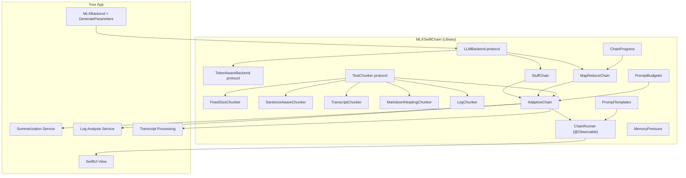

# Architecture

## Component Graph

## Key Design Decisions

### Protocol-Oriented
- `LLMBackend` is a simple `Sendable` protocol: `generate(prompt:systemPrompt:) async throws -> String`
- `TextChunker` defines how text is split: `chunk(_:) -> [TextChunk]`
- `DocumentChain` defines the processing contract with full options support
- `TokenAwareBackend` extends `LLMBackend` for backends that can provide context window size and token counting (opt-in)

### Strategy Selection
`AdaptiveChain` automatically picks the right strategy using `PromptBudgeter`:
- **Short text** (system prompt + task prompt + text + reserved output fits in budget): uses `StuffChain` — single LLM call, zero overhead
- **Long text** (exceeds budget): uses `MapReduceChain` — chunks, maps each, reduces combined results
- When `TokenAwareBackend` is available, budget checks use real token counts instead of word heuristics

### Hierarchical Reduce
When combined chunk summaries exceed the context budget, `MapReduceChain` automatically groups summaries and reduces in levels, preventing context overflow for very large documents. Chunk labels (`[Chunk N]`, `[Chunks X-Y]`) propagate through reduce levels for source traceability.

### Domain Chunkers
Five chunkers optimized for different document types:
- **FixedSizeChunker** / **SentenceAwareChunker**: general-purpose text
- **TranscriptChunker**: splits at speaker turns, preserves speaker labels and timestamps
- **MarkdownHeadingChunker**: splits at heading boundaries, preserves document structure
- **LogChunker**: splits at timestamp boundaries, keeps stack traces intact

### MLX-First
Ships with `MLXBackend` that wraps `ModelContainer` and `ChatSession` from `mlx-swift-lm`. Accepts `GenerateParameters` for temperature, maxTokens, topP, and other MLXLMCommon sampling controls. Designed for on-device inference on Apple Silicon.

### SwiftUI Integration
`ChainRunner` is an `@Observable` `@MainActor` class that wraps chain execution with reactive state (phase, isRunning, result, error) for direct use in SwiftUI views.

### Progress Reporting
`ChainProgress` provides an `AsyncStream<Update>` with phase information (stuffing, mapping step N of M, reducing, complete) and elapsed time. Optional — pass `nil` if you don't need it.

### Production Reliability
- **Memory pressure**: `MemoryPressure.current()` checks available memory before inference
- **Retry policy**: Configurable retries for transient failures (primarily for remote backends)
- **Bounded concurrency**: Configurable parallel map execution (default 1 for on-device)
- **Cancellation**: Cooperative cancellation via `Task.checkCancellation()` at each step
