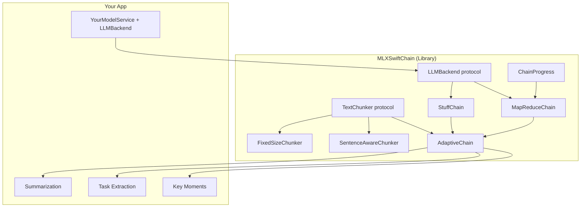

# Architecture

## Component Graph

## Key Design Decisions

### Protocol-Oriented
- `LLMBackend` is a simple `Sendable` protocol: `generate(prompt:systemPrompt:) async throws -> String`
- `TextChunker` defines how text is split: `chunk(_:) -> [TextChunk]`
- `DocumentChain` defines the processing contract: `run(_:mapPrompt:reducePrompt:systemPrompt:progress:) async throws -> String`

### Strategy Selection
`AdaptiveChain` automatically picks the right strategy:
- **Short text** (within `contextBudgetWords`): uses `StuffChain` — single LLM call, zero overhead
- **Long text** (exceeds budget): uses `MapReduceChain` — chunks, maps each, reduces combined results

### MLX-First
Ships with `MLXBackend` that wraps `ModelContainer` and `ChatSession` from `mlx-swift-lm`. Designed for on-device inference on Apple Silicon.

### Progress Reporting
`ChainProgress` provides an `AsyncStream<Update>` with phase information (stuffing, mapping step N of M, reducing, complete) and elapsed time. Optional — pass `nil` if you don't need it.
