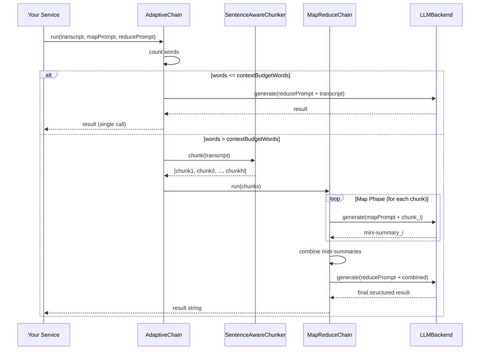

# Data Flow

## Map-Reduce Sequence

## Coverage Guarantee

The map-reduce approach guarantees **100% transcript coverage**:

| Meeting Length | Old (Prefix Truncation) | New (Map-Reduce) |
|---|---|---|
| 15 min (~2,500 words) | 100% coverage | 100% coverage |
| 30 min (~5,000 words) | ~60% coverage | 100% coverage |
| 1 hour (~10,000 words) | ~30% coverage | 100% coverage |
| 2 hours (~20,000 words) | ~7% coverage | 100% coverage |

The tradeoff is additional LLM calls (one per chunk + one reduce), which increases total processing time linearly with transcript length. For local inference on Apple Silicon, this is acceptable since the alternative is losing most of the content.
